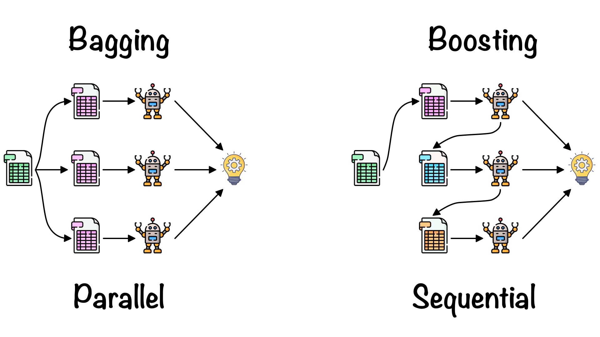
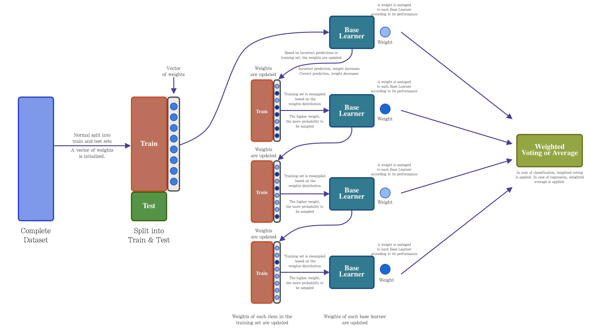
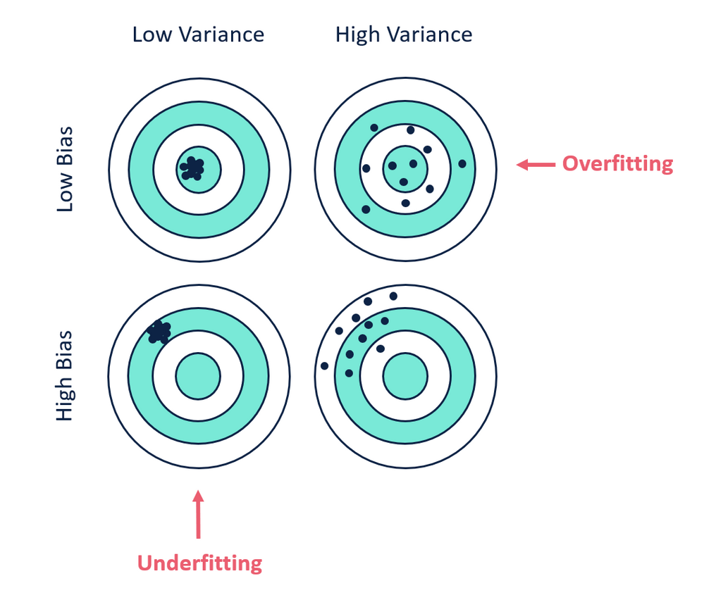

# **Emsemble methods**
The bias and variance tradeoff is one of the key concerns when working with machine learning algorithms. Fortunately there are some Ensemble Learning based techniques that machine learning practitioners can take advantage of in order to tackle the bias and variance tradeoff, these techniques are bagging and boosting. 

## **1. Bagging**

**Bagging** Bagging or Bootstrap Aggregation was formally introduced by Leo Breiman in 1996. Bagging is an Ensemble Learning technique which aims to reduce the error learning through the implementation of a set of homogeneous machine learning algorithms. The key idea of bagging is the use of multiple base learners which are trained separately with a random sample from the training set, which through a voting or averaging approach, produce a more stable and accurate model.
 The main two components of bagging technique are: the random sampling with replacement (bootstraping) and the set of homogeneous machine learning algorithms (ensemble learning). The bagging process is quite easy to understand, first it is extracted “n” subsets from the training set, then these subsets are used to train “n” base learners of the same type. For making a prediction, each one of the “n” learners are feed with the test sample, the output of each learner is averaged (in case of regression) or voted (in case of classification). Figure above shows an overview of the bagging architecture.
 It is important to notice that the number of subsets as well as the number of items per subset will be determined by the nature of your ML problem, the same for the type of ML algorithm to be used. In addition, Leo Breiman mention in his paper that he noticed that for classification problems are required more subsets in comparison with regression problems.
 **Code implementation** is here: [ensembleMethods-Bagging.ipynb](ensembleMethods-Bagging.ipynb)
## **2. Boosting**

**Boosting** is an Ensemble Learning technique that, like bagging, makes use of a set of base learners to improve the stability and effectiveness of a ML model. The idea behind a boosting architecture is the generation of sequential hypotheses, where each hypothesis tries to improve or correct the mistakes made in the previous one. The central idea of boosting is the implementation of homogeneous ML algorithms in a sequential way, where each of these ML algorithms tries to improve the stability of the model by focusing on the errors made by the previous ML algorithm. The way in which the errors of each base learner is considered to be improved with the next base learner in the sequence, is the key differentiator between all variations of the boosting technique.
 The boosting technique has been studied and improved over the years, several variations have been added to the core idea of boosting, some of the most popular are: AdaBoost (Adaptive Boosting), Gradient Boosting and XGBoost (Extreme Gradient Boosting). As mentioned above, the key differentiator between boosting-based techniques is the way in which errors are penalized (by modifying weights or minimizing a loss function) as well as how the data is sampled.
 **Code implementation** is here: [ensembleMethods-Boosting.ipynb](ensembleMethods-Boosting.ipynb)
## **3. Conclusion**
As we have seen, bagging is a technique that performs random samples with replacement to train “n” base learners, this allows the model to be processed in parallel. It is because of this random sampling that bagging is a technique that mostly allows to reduce the variance. On the other hand, boosting is a sequentially constructed technique where each model in the sequence tries to focus on the error of the previous base learner. Although boosting is a technique that mainly allows to reduce the variance, it is highly prone to over-fitting the model.
## **4. Bias and Variance**
### **a. 集成学习的偏差与方差**
偏差（Bias）描述的是预测值和真实值之差；方差（Variance）描述的是预测值作为随机变量的离散程度。放一张很经典的图：

**模型的偏差与方差**
* **偏差:** 描述样本拟合出的模型的预测结果的期望与样本真实结果的差距，要想偏差表现的好，就需要复杂化模型，增加模型的参数，但这样容易过拟合，过拟合对应上图的 High Variance，点会很分散。低偏差对应的点都打在靶心附近，所以喵的很准，但不一定很稳；
* **方差:** 描述样本上训练出来的模型在测试集上的表现，要想方差表现的好，需要简化模型，减少模型的复杂度，但这样容易欠拟合，欠拟合对应上图 High Bias，点偏离中心。低方差对应就是点都打的很集中，但不一定是靶心附近，手很稳，但不一定瞄的准。
 我们常说集成学习中的基模型是弱模型，通常来说弱模型是偏差高（在训练集上准确度低）方差小（防止过拟合能力强）的模型，但并不是所有集成学习框架中的基模型都是弱模型。Bagging 和 Stacking 中的基模型为强模型（偏差低，方差高），而Boosting 中的基模型为弱模型（偏差高，方差低）。在 Bagging 和 Boosting 框架中，通过计算基模型的期望和方差我们可以得到模型整体的期望和方差。

为了简化模型，我们假设基模型的期望为:$\mu$，方差$\sigma^2$，模型的权重为$r$，两两模型间的相关系数$\rho$相等。由于 Bagging 和 Boosting 的基模型都是线性组成的，那么有:

模型总体期望：
$$E(F)=E(\sum_i^m r_i f_i)=\sum_i^m r_i E(f_i)$$
 模型总体方差（公式推导参考协方差的性质，协方差与方差的关系）：
$$
\begin{split}
Var(f)&=Var(\sum_i^m r_i f_i)\\
&=\sum_i^m Var(r_i f_i)+\sum_{i \ne j}^m Cov(r_i f_i, r_j f_j)\\
&=\sum_i^m r_i^2 Var(f_i)+\sum_{i \ne j}^m \rho r_i r_j \sqrt{Var(f_i)} \sqrt{Var(f_j)}\\
&=m r^2 \sigma^2 + m (m-1) \rho r^2 \sigma^2\\
&=m r^2 \sigma^2(1-\rho)+m^2r^2\sigma^2\rho
\end{split}
$$
 模型的准确度可由偏差和方差共同决定：
$$
Error=bias^2+var+\xi
$$

### **b. Bagging的偏差与方差**

 对于Bagging 来说，每个基模型的权重等于$\frac 1 m$且期望近似相等，故我们可以得到：

$$
\begin{split}
E(F)&=\sum_i^m r_i E(f_i)\\
&= m \frac 1 m \mu\\
&=\mu
\end{split}
$$ 

$$
\begin{split}
Var(F)&=mr^2\sigma^2(1-\rho)+m^2 r^2 \sigma^2 \rho\\
&= m\frac 1 {m^2} \sigma^2 (1-\rho) + m^2 \frac 1 m^2\sigma^2\rho\\
&=\frac {\sigma^2 (1-\rho)} m +\sigma^2 \rho\\
\end{split}
$$ 
通过上式我们可以看到：
* 整体模型的期望等于基模型的期望，这也就意味着整体模型的偏差和基模型的偏差近似。
* 整体模型的方差小于等于基模型的方差，当且仅当相关性为 1 时取等号，随着基模型数量增多，整体模型的方差减少，从而防止过拟合的能力增强，模型的准确度得到提高。但是，模型的准确度一定会无限逼近于 1 吗？并不一定，当基模型数增加到一定程度时，方差公式第一项的改变对整体方差的作用很小，防止过拟合的能力达到极限，这便是准确度的极限了。

在此我们知道了为什么 Bagging 中的基模型一定要为强模型，如果 Bagging 使用弱模型则会导致整体模型的偏差提高，而准确度降低。Random Forest 是经典的基于 Bagging 框架的模型，并在此基础上通过引入特征采样和样本采样来降低基模型间的相关性，在公式中显著降低方差公式中的第二项，略微升高第一项，从而使得整体降低模型整体方差。
### **c. Boosting的偏差与方差**
对于 Boosting 来说，由于基模型共用同一套训练集，所以基模型间具有强相关性，故模型间的相关系数近似等于1，针对 Boosting 化简公式为： 
$$
\begin{split}
E(F)&=\sum_i^m r_i E(f_i)
\end{split}
$$ 

$$
\begin{split}
Var(F)&=mr^2\sigma^2(1-\rho)+m^2 r^2 \sigma^2 \rho\\
&= m\frac 1 {m^2} \sigma^2 (1-\rho) + m^2 \frac 1 m^2\sigma^2\rho\\
&=\sigma^2\\
\end{split}
$$ 

通过观察整体方差的表达式我们容易发现：
* 整体模型的方差等于基模型的方差，如果基模型不是弱模型，其方差相对较大，这将导致整体模型的方差很大，即无法达到防止过拟合的效果。因此，Boosting 框架中的基模型必须为弱模型。
* 此外 Boosting 框架中采用基于贪心策略的前向加法，整体模型的期望由基模型的期望累加而成，所以随着基模型数的增多，整体模型的期望值增加，整体模型的准确度提高。

基于 Boosting 框架的 Gradient Boosting Decision Tree 模型中基模型也为树模型，同 Random Forrest，我们也可以对特征进行随机抽样来使基模型间的相关性降低，从而达到减少方差的效果。

### **d. 小结**
* 我们可以使用模型的偏差和方差来近似描述模型的准确度；
* 对于 Bagging 来说，整体模型的偏差与基模型近似，而随着模型的增加可以降低整体模型的方差，故其基模型需要为强模型；
* 对于 Boosting 来说，整体模型的方差近似等于基模型的方差，而整体模型的偏差由基模型累加而成，故基模型需要为弱模型。

## **5. References：**
[1] 知乎[@阿泽](https://www.zhihu.com/search?type=content&q=random%20forest)
 [2] Towards data science[@Fernando López](https://towardsdatascience.com/ensemble-learning-bagging-boosting-3098079e5422)

